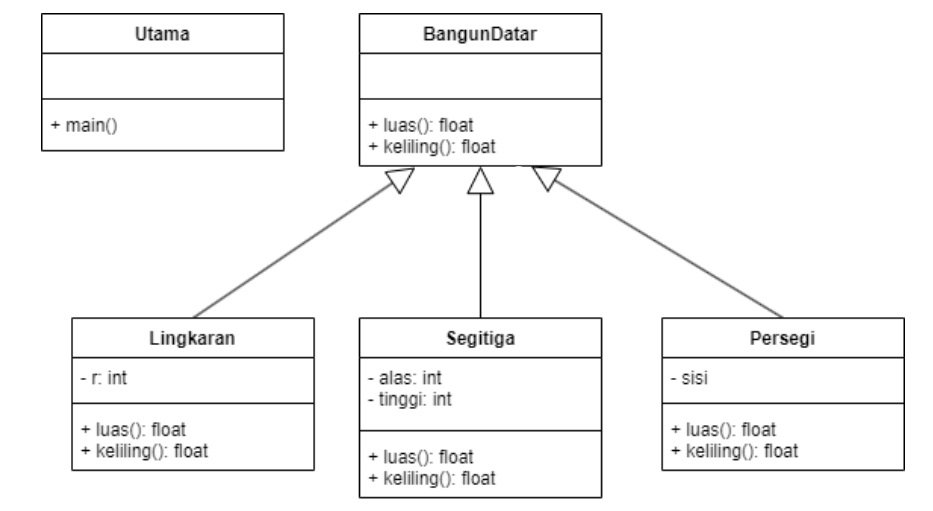
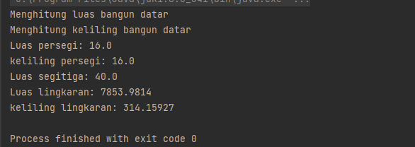

# Praktikum-4
## Pemrograman Orientasi Objek

```sh
Nama   : Raihan Tantowi
Nim    : 312110229
Matkul : Pemrograman Orientasi Objek
```

### •  Implementasikan java code diagram class berikut:

Pada diagram tersebut, terdapat 5 class, yaitu BangunDatar sebagai superclass yang memiliki 3 subclass, yaitu: Lingkaran, Segitiga, dan Persegi. Lalu yang terakhir ada class utama (main) yang berfungsi sebagai run dari sebuah program.

### 1. File BangunDatar.java
Buatlah class baru dengan nama BangunDatar,  kemudian isi dengan kode berikut.
* **Source code:**
```java
 public class BangunDatar {
   float luas(){
      System.out.println("Menghitung luas bangun datar");
      return 0;
   }

   float keliling(){
      System.out.println("Menghitung keliling bangun datar");
      return 0;
   }
}
```

### 2. File Lingkaran.java
Selanjutnya buat class baru dengan nama Lingkaran, kemudian berikan kode extends pada class lingkaran, lalu di lanjut dengan isi class yang sebelumnya yaitu BangunDatar.
* **Source code:**
```java
public class Lingkaran extends BangunDatar {
   int r;

   public Lingkaran(int r) {
      this.r = r;
   }

   @Override
   public float luas(){
      return (float) (Math.PI * r * r);
   }

   @Override
   public float keliling(){
      return (float) (2 * Math.PI * r);
   }

}
```

### 3. File Segitiga.java
Selanjutnya buat class baru dengan nama Segitiga, kemudian berikan kode extends pada class Segitiga, cara ini sama saja dengan class yang sebelumnya.
* **Source code:**
```java
public class Segitiga extends BangunDatar{
   int alas;
   int tinggi;

   public Segitiga(int alas, int tinggi) {
      this.alas = alas;
      this.tinggi = tinggi;
   }


   @Override
   public float luas(){
      return this.alas * this.tinggi;
   }
}
```

### 4. File Persegi.java
Selanjutnya buat class baru lagi dengan nama Persegi, kemudian berikan kode extends.
* **Source code:**
```java
public class Persegi extends BangunDatar{
   int sisi;

   public Persegi(int sisi) {
      this.sisi = sisi;
   }

   @Override
   public float luas() {
      return this.sisi * this.sisi;
   }

   @Override
   public float keliling(){
      return this.sisi * 4;
   }
}
```

### 5. File Utama.java
Selanjutnya langkah yang terakhir yaitu buat class dengan nama utama, class utama (main) ini yang nantinya akan terhubung dengan class yang sudah dibuat sebelumnya, selain itu class utama (main) berfungsi sebagai run dari sebuah program., kemudian yang selanjutnya isi dengan kode berikut.
* **Source code:**
```java
public class Utama {
   public static void main(String[] args) {

      BangunDatar bangunDatar = new BangunDatar();
      Persegi persegi = new Persegi(4);
      Segitiga segitiga = new Segitiga(8, 5);
      Lingkaran lingkaran = new Lingkaran(50);

      // memanggil method luas dan keliling
      bangunDatar.luas();
      bangunDatar.keliling();

      System.out.println("Luas persegi: " + persegi.luas());
      System.out.println("keliling persegi: " + persegi.keliling());
      System.out.println("Luas segitiga: " + segitiga.luas());
      System.out.println("Luas lingkaran: " + lingkaran.luas());
      System.out.println("keliling lingkaran: " + lingkaran.keliling());
   }
}
```

* **Berikut adalah hasil output program:**




### *Sekian Terima Kasih :)*